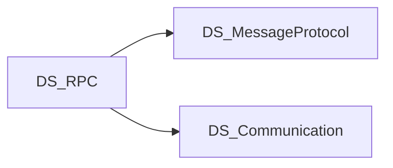

# Scope

## 목적

Attribute 기반 RPC 계약과 RUDP 전송을 결합해 클라이언트↔서버 원격 호출을 제공한다.

## In scope

- RPC Attribute·Shared·Client·Server·CodeGenerator
- MessageProtocol / Communication(RUDP) NuGet 연동
- Examples/Sandbox (Contracts, Server, Client)

## Out of scope

- 저수준 소켓/전송 구현 (→ DS_Communication)
- 범용 메시지 직렬화 엔진 (→ DS_MessageProtocol)

## 의존·형제 프로젝트

- **DS_MessageProtocol**: 직렬화 (`MessageProtocolPackageVersion` in Directory.Build.props)
- **DS_Communication**: RUDP 등 전송 (`CommunicationPackageVersion`)
- 버전은 저장소 루트 `Directory.Build.props`에서 관리

## 관련

- [[CONTEXT]]
- [[Home]]
- [[Packages]]