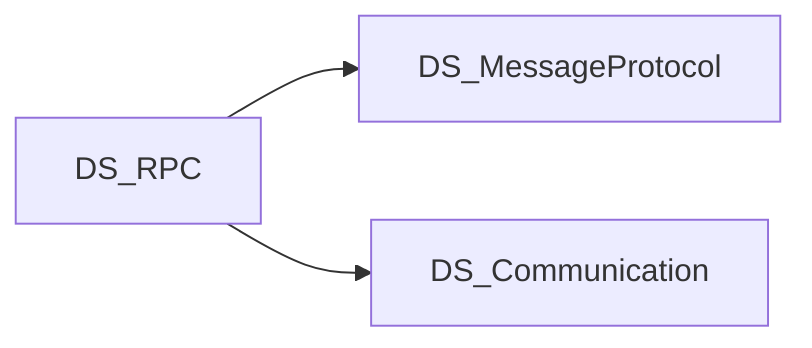

# Scope

## 목적

Attribute 기반 RPC 계약과 RUDP 전송을 결합해 클라이언트↔서버 원격 호출을 제공한다.

## In scope

- `Source/` 라이브러리: Attribute·Shared·Client·Server·CodeGenerator
- MessageProtocol / Communication(RUDP) NuGet 연동
- `Examples/Sandbox.*` (Contracts, Server, Client) 동작 예제
- `TemplateSource/` Hub·생성기 최소 템플릿
- 솔루션 `DRPC.slnx`, NuGet 패키징·태그 게시 워크플로
- 이 Document vault의 구조·API·데이터 흐름 문서

## Out of scope

- 저수준 소켓/전송 구현 (→ DS_Communication)
- 범용 메시지 직렬화 엔진 (→ DS_MessageProtocol)
- 단위/통합 `Test/` 프로젝트 (현재 저장소에 없음)

## 의존·형제 프로젝트

- **DS_MessageProtocol**: 직렬화 (`MessageProtocolPackageVersion` in Directory.Build.props)
- **DS_Communication**: RUDP 등 전송 (`CommunicationPackageVersion`)
- 버전은 저장소 루트 `Directory.Build.props`에서 관리

## 관련

- [[CONTEXT]]
- [[Home]]
- [[Packages]]
- [[Overview]]
