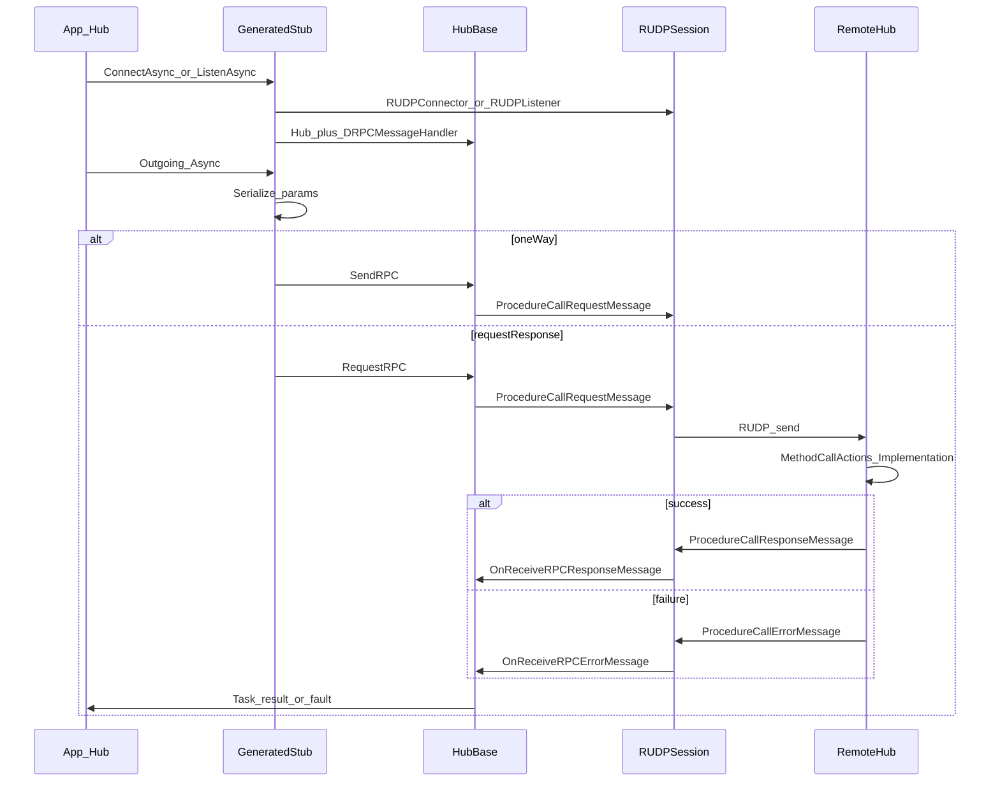

# Data Flow

요청·메시지·패킷이 시스템을 통과하는 경로.

## Happy path

1. **연결 (클라)**: 생성 `ConnectAsync(host, port, connectionKey?, ct)` → `RUDPConnector.ConnectAsync(..., ct)` → `ServerHub` + `ServerSession` + `DRPCMessageHandler`. 실패 시 `InvalidOperationException("Failed to connect to server.")`.
2. **연결 (서버)**: 생성 `ListenAsync(port, connectionKey?, onConnected, ct)` → `RUDPListener` → peer마다 `ClientHub` + `ClientSession` + `DRPCMessageHandler` → `onConnected(hub)`.
3. **Outgoing**: 직렬화 후 one-way면 `SendRPC`, 아니면 `RequestRPC` (TCS + `RpcTimeout`).
4. **요청 전송**: CallId(`Interlocked`/재사용 스택), `ProcedureCallRequestMessage`(id 0).
5. **Incoming**: `OnReceiveRPCRequestMessage`가 `ProcessRequestAsync`를 논블로킹 시작 → `MethodCallActions` → `{Name}_Implementation`.
6. **응답**: 성공 시 id 1 `ProcedureCallResponseMessage`; 예외/UnknownMethod 시 id 2 `ProcedureCallErrorMessage` (`RpcFaultException`). OneWay면 응답 없음.
7. **완료**: Response → TCS `SetResult`; Error → `SetException`; CallId 재사용. 끊김 시 `CancelPendingCalls`.

## 와이어 메시지

| MessageId | 타입 | 필드 |
|-----------|------|------|
| 0 | `ProcedureCallRequestMessage` | `CallId`, `MethodId`, `ParameterData` |
| 1 | `ProcedureCallResponseMessage` | `CallId`, `ReturnData` |
| 2 | `ProcedureCallErrorMessage` | `CallId`, `ErrorCode`, `Message` |

## 에러·대기

| 상황 | 동작 |
|------|------|
| Unknown MethodId (non-one-way) | ErrorCode `UnknownMethod` 응답 |
| Implementation 예외 | ErrorCode `Unhandled` 응답 → 호출측 `RpcFaultException` |
| 응답 대기 초과 | `HubBase.RpcTimeout`(기본 30s) → `TimeoutException` |
| 세션 끊김 | `CancelPendingCalls` → pending TCS에 exception |
| 늦은/중복 응답 CallId | 대기 Task 없으면 ignore |
| `ConnectAsync` 실패 | `InvalidOperationException("Failed to connect to server.")` |

생성기 진단: DRPCGEN001 partial, DRPCGEN002 Hub base, DRPCGEN003 타입, DRPCGEN004 명시 MethodId 권장(warning), DRPCGEN005 중복 MethodId, DRPCGEN006 OneWay+non-void.

## 관련

- [[Overview]]
- [[Components]]
- [[Public-API]]
- [[FAQ]]
- [[Known-Issues]]
