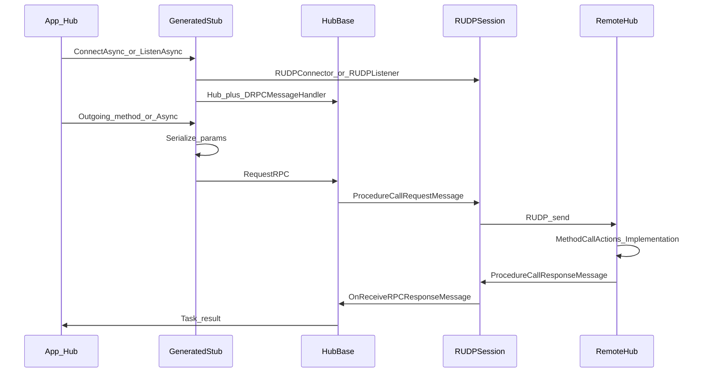

# Data Flow

요청·메시지·패킷이 시스템을 통과하는 경로.

## Happy path

1. **연결 (클라)**: 생성 `ConnectAsync(host, port, connectionKey?, ct)` → `RUDPConnector` → `ServerHub` + `ServerSession` + `DRPCMessageHandler`. 실패 시 `InvalidOperationException("Failed to connect to server.")`.
2. **연결 (서버)**: 생성 `ListenAsync(port, connectionKey?, onConnected, ct)` → `RUDPListener` → peer마다 `ClientHub` + `ClientSession` + `DRPCMessageHandler` → `onConnected(hub)`.
3. **Outgoing 호출**: 생성 stub이 파라미터를 MessageProtocol로 직렬화한 뒤 `HubBase.RequestRPC(methodId, parameterData, reliableType)` 호출.
4. **요청 전송**: CallId 할당(재사용 스택 또는 증가), `WaitResponseTasks`에 TCS 등록, `ProcedureCallRequestMessage`(StandaloneMessage 0: CallId, MethodId, ParameterData)를 `ReliableType`과 함께 `ISession.SendAsync`.
5. **Incoming 수신**: 상대 `DRPCMessageHandler` → `OnReceiveRPCRequestMessage` → `MethodCallActions[methodId]` → 생성 디스패치 → 사용자 `{Name}_Implementation` → 반환값 직렬화.
6. **응답 전송**: `ProcedureCallResponseMessage`(StandaloneMessage 1: CallId, ReturnData) 회신.
7. **호출 완료**: `OnReceiveRPCResponseMessage`가 CallId로 TCS를 찾아 `SetResult`, CallId를 재사용 스택에 push, Outgoing stub이 반환값을 역직렬화해 호출자에게 전달.

## 와이어 메시지

| MessageId | 타입 | 필드 |
|-----------|------|------|
| 0 | `ProcedureCallRequestMessage` | `CallId`, `MethodId`, `ParameterData` |
| 1 | `ProcedureCallResponseMessage` | `CallId`, `ReturnData` |

## 에러·대기

코드에 명시된 동작만 기록한다. 별도 타임아웃·재시도 정책은 HubBase에 없다.

| 상황 | 동작 |
|------|------|
| 수신 MethodId에 등록된 Action 없음 | `ArgumentException`: `"The method {MethodId} does not exist."` |
| 응답 CallId에 대기 Task 없음 | `InvalidOperationException`: `"The task {CallId} does not exist."` |
| `ConnectAsync` 연결 실패 | `InvalidOperationException`: `"Failed to connect to server."` |
| 응답 대기 | `RequestRPC`가 TCS `Task`를 `await` (완료될 때까지 대기) |

생성기 진단: Hub가 `partial`이 아니면 DRPCGEN001, `ServerHub`/`ClientHub` 미상속이면 DRPCGEN002, 지원하지 않는 파라미터/반환 타입이면 DRPCGEN003.

## 관련

- [[Overview]]
- [[Components]]
- [[Public-API]]
- [[FAQ]]
