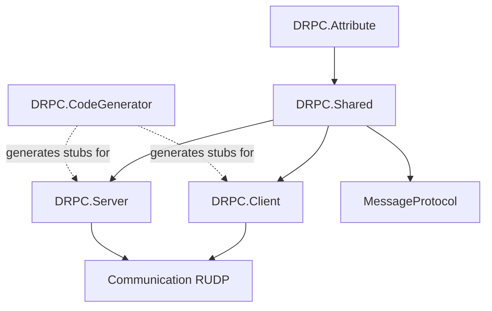

# Architecture Overview

Attribute로 계약을 선언하고 CodeGenerator가 스텁을 생성한다. Shared가 MessageProtocol과 연동하고, Client/Server가 Communication RUDP 위에 RPC를 올린다.

## 저장소 레이아웃

| 경로 | 역할 |
|------|------|
| `Source/` | NuGet 배포 라이브러리 5개 (`IsPackable=true`, TFM `netstandard2.1`) |
| `Sandbox/` | 데모 (Contracts / Server / Client, TFM `net10.0`) |
| `TemplateSource/` | Hub·생성기 사용 최소 템플릿 (비배포) |
| `Document/` | Obsidian 문서 vault |
| `DRPC.slnx` | 솔루션 (Source + TemplateSource + Sandbox) |
| `Directory.Build.props` | 공통 LangVersion, PolySharp, MP/Comm 패키지 버전 |
| `Source/Directory.Build.props` | 패키징 메타·TFM·루트 props Import |
| `.github/workflows/` | 태그 `v*` NuGet 게시 |

`Test/` 폴더는 `Test/DRPC.Shared.Tests`이다. 샌드박스는 루트 `Sandbox/` 아래 `Sandbox.*` 프로젝트이다.

## 패키지·레이어

계약 → 생성 → `HubBase` → MessageProtocol 직렬화 → Communication RUDP 전송.

## 주요 원칙

- **Attribute 계약**: 인터페이스 메서드에 `[RemoteProcedure(ReliableType)]`만 선언한다.
- **Roslyn stub**: `partial` Hub가 `ServerHub<,>` / `ClientHub<,>`를 상속하면 Outgoing·Incoming·Connect/Listen을 생성한다.
- **계층 분리**: 전송은 DS_Communication(RUDP), 페이로드 직렬화는 DS_MessageProtocol에 위임한다.
- **메서드별 reliability**: Attribute의 `ReliableType`이 `MessageSendContext.Reliable`로 전달된다.
- **양방향 RPC**: ServerDecls / ClientDecls를 Hub 양쪽에서 호출한다.

## Hub 명명

| 타입 | 위치 | 의미 |
|------|------|------|
| `ServerHub<,>` | `DRPC.Client` | 클라이언트가 서버에 붙을 때 쓰는 Hub |
| `ClientHub<,>` | `DRPC.Server` | 서버가 클라이언트 peer마다 만드는 Hub |

## 관련

- [[Components]]
- [[Data-Flow]]
- [[Structure-Performance]]
- [[Packages]]
- [[CONTEXT]]
