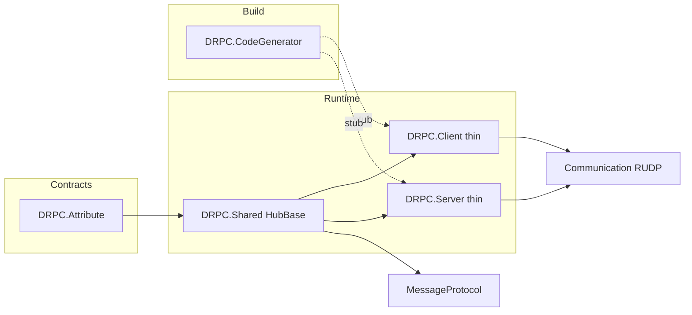

# Structure · Performance · Bottlenecks

코드(`Source/`) 기준 구조·성능·병목과 해결 방안. **P0–P3 중 DS_RPC 범위는 2026-07-11 반영됨** — 체크리스트는 [[Known-Issues]]. 형제/major 잔여만 아래에 남긴다.

## 현재 구조 (요약)



| 레이어 | 실제 역할 | 비고 |
|--------|-----------|------|
| Attribute | `[RemoteProcedure]` 계약 | 가벼움 — 적절 |
| Shared | `HubBase`, 메시지 0/1/2, `DRPCMessageHandler` | **실질 런타임 전부** |
| Client / Server | Hub·Session 얇은 래퍼 | 패키지 경계는 있으나 로직 거의 없음 |
| CodeGenerator | Outgoing/Incoming/Connect·Listen | 핫패스 직렬화 형태를 결정 |

핫패스: Outgoing serialize → `RequestRPC`/`SendRPC` → RUDP → Incoming deserialize → `_Implementation` → Response serialize.

---

## 1. 구조 문제점과 해결

### 1.1 Hub 명명·네임스페이스 혼동

| 문제 | 증거 |
|------|------|
| `ServerHub`는 **클라이언트** 패키지, `ClientHub`는 **서버** 패키지 | `DRPC.Client.Network.ServerHub`, `DRPC.Server.Netwrok.ClientHub` |
| `Netwrok` 오타 고정 | 생성기 DRPCGEN002·공개 API |
| TemplateSource 계약 파일명 오타 | `IExampleServerProcedureDeclartions` |

**영향**: 온보딩·리뷰 비용, FAQ 의존.

**해결**

| 단계 | 방안 | 비고 |
|------|------|------|
| 단기 | 문서·진단 메시지에 “상대 세션 기준” 명시 유지 | 이미 [[FAQ]]·[[GLOSSARY]] |
| 중기 | alias type 추가 예: `ClientToServerHub = ServerHub` | 비파괴 |
| 장기 | `v2`에서 `ClientHub`/`ServerHub` 의미 정렬 + `Network` 철자 수정 | **breaking**; ADR 필요 |

### 1.2 Client/Server 패키지가 얇음

`ServerSession` / `ClientSession`은 `OnDisconnected`에서 `Console.WriteLine`만 수행. Hub 베이스도 생성자 위임뿐.

**영향**: 패키지 분리 이점은 의존(LiteNetLib Client vs Server) 격리뿐이고, 앱별 disconnect/로깅 훅이 없다.

**해결**

1. `protected virtual void OnSessionDisconnected()`를 Session 또는 Hub에 두고 생성기/`DRPCMessageHandler`와 연결.
2. `Console.WriteLine` 제거 → 이벤트/`ILogger`/콜백으로 교체 (라이브러리에 콘솔 의존 금지).
3. 공통 세션 어댑터를 Shared로 올리고 Client/Server는 RUDP peer 생성만 담당하는 것도 검토 (의존 그래프 재설계 시).

### 1.3 Hub·Listener 수명 주기 부재

- `ListenAsync`가 `RUDPListener`를 생성·`Start`하지만 Hub/`IDisposable`로 묶이지 않음.
- Disconnect 시 pending cancel(`CancelPendingCalls`)은 있으나 Hub/Listener/Connector Dispose API 없음.

**영향**: 장기 서버에서 리스너·peer 리소스 누수, 재바인드 실패.

**해결**

1. 생성 `ListenAsync`가 `IAsyncDisposable` 핸들(리스너+등록 peer 목록)을 반환하거나, static 대신 인스턴스 `RpcHost` 도입.
2. `HubBase`에 `Dispose`/`DisconnectAsync` → 세션 종료 + `CancelPendingCalls`.
3. Sandbox에 “정상 종료” 예제 추가.

### 1.4 테스트·회귀 인프라

`Test/DRPC.Shared.Tests`(xUnit, HubBase) 추가됨. 생성기 스냅샷·Sandbox 헤드리스 통합은 잔여.

| 우선 | 내용 | 상태 |
|------|------|------|
| P0 | HubBase 단위 테스트 | **완료** |
| P1 | 생성기 스냅샷/Roslyn 테스트 (DRPCGEN001–006) | 잔여 |
| P2 | Sandbox 헤드리스 통합 (loopback RUDP) | 잔여 |

### 1.5 생성 Connect/Listen 보일러플레이트 중복

`DefaultMessageConverter`·Receiver/Sender 조립이 생성 코드에 인라인. peer마다 converter 인스턴스 2개.

**해결**

- Shared에 `HubSessionFactory` / `CreateRudpPipeline(hub, peer, …)` 헬퍼 → 생성기는 한 줄 호출.
- Converter를 static/singleton 가능하면 공유 (MessageProtocol이 무상태인지 확인 후).

---

## 2. 성능·병목과 해결

### 2.1 이중 직렬화 (핫패스 최대 병목)

```text
파라미터 객체
  → NonIdMessage Serialize → byte[] ParameterData
  → ProcedureCallRequestMessage(Standalone 0) Serialize → 와이어
```

응답도 `ReturnData` byte[] → outer Standalone 1 동일 패턴.

**영향**: CPU·GC 압박이 RPC 횟수에 비례해 2배. 큰 페이로드일수록 복사 비용 큼.

**해결**

| 단계 | 방안 |
|------|------|
| 단기 | 작은 인자·반환 유지; 대용량은 별도 스트림/청크 API(형제 스택) |
| 중기 | MessageProtocol에 “임베디드 필드 in-place 쓰기” 또는 payload를 outer 버퍼에 직접 append |
| 장기 | MethodId별 generated writer가 **단일 버퍼**에 CallId+MethodId+args 기록 (중간 `byte[]` 제거) |

형제 프로젝트(MessageProtocol) 제약과 맞물림 → ADR로 경계 합의.

### 2.2 `byte[]` 전면 · 풀링 없음

`HubBase`, 생성 Outgoing/Incoming, 메시지 필드 모두 `byte[]`. `ArrayPool`/`Memory<byte>` 미사용.

**해결**

1. 직렬화 API가 `IBufferWriter<byte>` / `ArrayPool` 대여를 지원하면 Hub·생성기를 그쪽으로 이전.
2. 응답 완료·전송 후 버퍼 반환 규약 문서화 (수명: Send 완료 시점).
3. netstandard2.1 + Unity 제약 안에서 `Memory`/`Span` 사용 가능 여부 확인.

### 2.3 OneWay `SendRPC`의 CallId 누수

```63:69:Source/DRPC.Shared/Network/HubBase.cs
    protected async Task SendRPC(int methodId, byte[] parameterData, ReliableType reliableType)
    {
        uint callId = AllocateCallId();
        // ... SendAsync — CallId를 _usedCallId로 반환하지 않음
```

OneWay는 응답이 없어 CallId가 풀에 돌아오지 않음 → `_nextCallId` 단조 증가.

**영향**: 고빈도 OneWay에서 CallId 고갈(uint wrap) 및 재사용 스택 이점 상실. wrap 후 충돌 위험.

**해결 (권장 즉시)**

1. OneWay는 **고정 CallId(예: 0)** 또는 CallId 필드 생략 가능한 메시지 변형 사용.
2. 또는 `SendRPC` 전송 직후 `_usedCallId.Push(callId)` (수신측이 CallId를 무시한다면).
3. 와이어 호환을 깨면 `ProcedureCallRequestMessage`에 `Flags`/`OneWay` 비트 + 스키마 버전.

### 2.4 RequestRPC 호출당 할당

호출마다: `TaskCompletionSource`, `CancellationTokenSource`, `CancellationTokenRegistration`, `MessageSendContext`, 요청 메시지 객체.

**영향**: 초당 수천 RPC에서 GC 스파이크.

**해결**

1. `RpcTimeout`이 Infinite일 때 CTS 생략 — **이미 구현됨**.
2. 타임아웃을 Hub당 공유 `PeriodicTimer`/휠로 처리해 per-call CTS 제거.
3. `MessageSendContext`를 구조체/스택 할당 또는 재사용 필드로.
4. TCS 풀링은 이득 대비 복잡도 높음 — 측정 후.

### 2.5 CallId 재사용 + 늦은 응답

완료 시 CallId를 `ConcurrentStack`에 push 후 재할당. 이전 호출의 **지연 응답**이 새 호출 TCS를 완료할 수 있음 (`TryRemove`만으로는 generation 구분 불가).

**영향**: 드묾(타임아웃 후 응답, 재정렬)이지만 잘못된 결과/예외 가능.

**해결**

1. CallId를 **재사용하지 않음** (uint 순환 + in-flight 맵에 있을 때만 충돌 검사) — 단순.
2. 또는 `CallId`(32) + `Generation`(32) / 상위 비트 epoch.
3. 타임아웃 후 도착한 응답은 “이미 제거됨”으로 ignore — **현재도 TryRemove 실패 시 ignore**. 문제는 **재사용 후** 도착하는 경우.

### 2.6 Incoming Implementation이 sync only

생성 `_Requested`가 `{Name}_Implementation()`을 동기 호출 후 `Task.FromResult`.

**영향**: DB/디스크/다른 RPC를 Implementation에서 부르면 해당 요청 Task(및 스레드풀)를 점유. fire-and-forget으로 수신 큐는 막지 않지만 **동시성·백프레셔**는 앱 책임.

**해결**

1. `partial Task` / `partial ValueTask` Implementation 허용 (생성기 확장).
2. 가이드: 긴 작업은 Implementation에서 `Task.Run`하지 말고 async Implementation으로 await.
3. 서버에 per-hub concurrency limit(세마포어) 옵션.

### 2.7 수신 경로 fire-and-forget

`OnReceiveRPCRequestMessage` → `_ = ProcessRequestAsync(message)`.

**영향**: Communication `MessageHandler`가 동기 `Action<object>`인 한계를 DRPC가 우회. Unobserved 예외는 catch로 대부분 흡수. 다만 **요청 폭주 시** 무한 Task 생성 → 메모리·스레드풀 고갈.

**해결**

1. 단기: Hub에 `MaxConcurrentIncoming`(세마포어) — 초과 시 Error 또는 drop(정책 선택).
2. 중기: DS_Communication에 awaitable 수신 큐/`ValueTask` 핸들러 도입 후 DRPC 연동.
3. 메트릭: in-flight incoming 카운터 노출.

### 2.8 Obsolete sync Outgoing (`GetAwaiter().GetResult`)

생성 sync 메서드가 여전히 블로킹.

**영향**: UI/Unity 메인 스레드·스레드풀에서 호출 시 데드락·스터베이션.

**해결**

1. 사용 금지 가이드 유지 (`{Method}Async` only).
2. 다음 major에서 sync 생성 **제거** 또는 `#if`/analyzer error로 격상.
3. Unity면 Player Loop 친화적 await 가이드를 [[How-To]]에 명시.

### 2.9 응답 `SendAsync`에 ReliableType 미전달

요청은 Attribute `ReliableType`을 `MessageSendContext`로 전달. 응답/에러는 세션 기본(ReliableOrdered 가정).

**영향**: Unreliable 요청에 대한 응답이 오히려 reliable로 가거나, 정책 불일치.

**해결**

1. 요청 컨텍스트에 ReliableType을 in-flight 맵에 저장 → 응답 시 동일 적용.
2. 또는 응답은 항상 ReliableOrdered로 **문서화** (현재 동작 고정) — 단순·예측 가능.

### 2.10 Session disconnect 로깅

`Console.WriteLine`은 Unity/서버에서 성능·노이즈 문제.

**해결**: 1.2와 동일 — 콜백/이벤트, 기본 no-op.

---

## 3. 우선순위 로드맵

| 우선 | 항목 | 상태 |
|------|------|------|
| **P0** | OneWay CallId 누수 / Test/ | **완료** (CallId=0, `Test/DRPC.Shared.Tests`) |
| **P1** | async Implementation / Dispose·disconnect / Console | **완료** |
| **P2** | concurrency / CallId 비재사용 / 응답 ReliableType | **완료** |
| **P2** | 이중 직렬화 / 버퍼 풀 | **연기** [[0001-defer-double-serialization]] |
| **P3** | Hub 타임아웃 스캔 / alias | **완료** |
| **P3** | `Netwrok` rename | **연기** [[0002-defer-netwrok-rename]] |

측정 없이 버퍼 최적화를 먼저 하지 말 것. Sandbox 또는 벤치에서 **RPC/s, GC alloc/call** 베이스라인 후 MessageProtocol 합의.

---

## 4. 권장 운영

- Outgoing은 **`{Method}Async`만**.
- 알림성 void는 **`OneWay = true`**.
- 계약에 **명시 MethodId**.
- Implementation은 짧게; 긴 I/O는 async Implementation에서 await.
- `hub.RpcTimeout` / `MaxConcurrentIncoming`을 워크로드에 맞게 조정 (상한은 유휴 시 설정).
- 대용량 페이로드는 RPC 인자로 넣지 말 것.
- 태그 NuGet 게시 전 CodeGenerator↔MP CI 경로를 확인 ([[Known-Issues]]).

---

## 관련

- [[Known-Issues]] — 수정 완료·잔여 체크리스트
- [[Overview]]
- [[Components]]
- [[Data-Flow]]
- [[FAQ]]
- [[Public-API]]
- [[Configuration]]
- [[_Template]] — 명명/직렬화 변경 시 ADR
