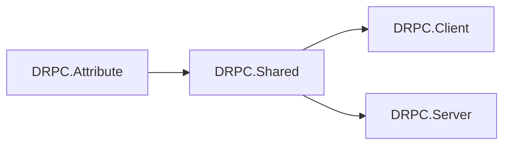

# Packages

## 배포 라이브러리 (`Source/`, packable)

| 패키지 ID | 경로 | TFM | 설명 |
|-----------|------|-----|------|
| **DRPC.Attribute** | `Source/DRPC.Attribute/` | netstandard2.1 | RPC 계약용 Attribute |
| **DRPC.Shared** | `Source/DRPC.Shared/` | netstandard2.1 | 공유 타입·직렬화·MessageProtocol 연동 |
| **DRPC.Client** | `Source/DRPC.Client/` | netstandard2.1 | 클라이언트 RPC 및 RUDP 클라이언트 연동 |
| **DRPC.Server** | `Source/DRPC.Server/` | netstandard2.1 | 서버 RPC 및 RUDP 서버 연동 |
| **DRPC.CodeGenerator** | `Source/DRPC.CodeGenerator/` | netstandard2.1 | Roslyn Analyzer/소스 생성기 (`DevelopmentDependency`) |

`Source/Directory.Build.props`에서 `IsPackable=true`, 기본 `Version=1.1.0`.

## 패키지 간 의존

| 패키지 | 프로젝트/패키지 참조 |
|--------|----------------------|
| Attribute | `Communication.Network.RUDP.Shared` |
| Shared | Attribute; `MessageProtocol.Core` (+ 자체 CodeGenerator NuGet for Shared 메시지); `Communication.Shared`, RUDP.Shared |
| Client | Shared; RUDP.Client + Shared; LiteNetLib 1.3.5 |
| Server | Shared; RUDP.Server + Shared; LiteNetLib 1.3.5 |
| CodeGenerator | Microsoft.CodeAnalysis.CSharp **4.14.0**; 형제 `DS_MessageProtocol`의 `MessageProtocol.CodeGenerator` **ProjectReference** (빌드 출력 옆에 DLL 복사; CodeAnalysis DLL은 출력에서 제거). NuGet `MessageProtocol.CodeGenerator` 단독 HintPath 참조는 사용하지 않음 |

## 비배포 프로젝트

| 프로젝트 | 경로 | TFM | 역할 |
|----------|------|-----|------|
| Sandbox.Contracts | `Sandbox/Sandbox.Contracts/` | net10.0 | 계약·메시지 타입. `MessageProtocol.CodeGenerator`는 **Contracts 전용** analyzer (`IncludeAssets`에 `analyzers`, **`buildtransitive` 없음**) — Client/Server로 MP 생성기가 전파되지 않아 DRPC 생성기와 DLL 이중 로드를 피한다 |
| Sandbox.Client | `Sandbox/Sandbox.Client/` | net10.0 Exe | 클라 Hub + Connect; Analyzer는 `DRPC.CodeGenerator` |
| Sandbox.Server | `Sandbox/Sandbox.Server/` | net10.0 Exe | 서버 Hub + Listen; Analyzer는 `DRPC.CodeGenerator` |
| TemplateSource | `TemplateSource/` | net10.0 | 최소 계약 (+ 필요 시 MP CodeGenerator) |
| TemplateSource_Client / _Server | `TemplateSource/` | net10.0 Exe | Hub 구현 템플릿 |
| DRPC.Shared.Tests | `Test/DRPC.Shared.Tests/` | net10.0 | HubBase 단위 테스트 (xUnit); `DRPC.slnx` `/Test/` |

루트 `Directory.Build.props` 기본 `IsPackable=false`.

## 설치

NuGet.org에서 패키지 ID로 검색한다. 서버/클라 조합에 맞게 Shared·Attribute를 기준으로 Client 또는 Server와 CodeGenerator(Analyzer)를 추가한다. 상세는 루트 `README.md`.

## 버전

- 형제 NuGet: `MessageProtocolPackageVersion`, `CommunicationPackageVersion` (루트 `Directory.Build.props`, 현재 `1.0.0`)
- 게시: 태그 `v1.1.0` → GitHub Actions가 동일 버전으로 pack·publish (`NUGET_API_KEY`)

## 관련

- [[Public-API]]
- [[Configuration]]
- [[Scope]]
- [[Components]]
